# MedicalMate (Back-end Part)

## Project Description
MedicalMate is an innovative online clinic based in the USA, offering a comprehensive range of medical services across 12 specialized departments. With the aim of providing convenient and accessible healthcare, MedicalMate allows individuals to easily schedule appointments with their desired department. Our dedicated team of healthcare professionals ensures that patients receive top-notch care and personalized attention. Whether you require medical consultation, diagnostic tests, or treatment, MedicalMate is committed to delivering exceptional service and enhancing the overall patient experience. Take advantage of our user-friendly platform and experience the convenience and satisfaction of receiving high-quality healthcare from the comfort of your own home.

## Motivation
The motivation behind creating MedicalMAte was to address the growing need for accessible and convenient healthcare services. Traditional clinic visits often involve long wait times, limited availability, and geographical constraints. MedicalMAte aims to overcome these challenges by providing an online platform where individuals can easily schedule appointments with various medical departments. This innovative approach not only saves time and eliminates the need for travel but also offers individuals the flexibility to receive medical care on their own terms. By leveraging technology and a team of skilled professionals, MedicalMAte strives to enhance the overall patient experience and make quality healthcare more accessible to a wider population.

## Tech Stack
- **Java** (for back-end code logic)
- **Spring Boot** (Java web development Framework)
- **Docker** (for storing project dependencies and services in containers)
- **Docker Desktop** (necessary program for Windows)
- **PostgreSQL** (DB communication)
- **Swager** (Interactive API Documentation)
- **Insomnia** (Utility for working with Requests)


## Why Java and Spring Boot?
1. **Robust and Mature Framework**: Java and Spring Boot are widely recognized as a robust and mature framework for building enterprise-grade applications. They provide a comprehensive set of tools, libraries, and features that facilitate rapid development, maintainability, and scalability.

2. **Strong Community Support**: Java and Spring Boot have a large and active community of developers, which ensures continuous improvement, regular updates, and access to a vast array of resources and knowledge. This community support enables faster issue resolution, access to best practices, and a vibrant ecosystem of third-party libraries and extensions.

3. **Security and Reliability**: Java and Spring Boot have built-in security features and frameworks that help developers implement robust security measures, such as authentication and authorization. Additionally, the frameworks offer extensive error handling capabilities, ensuring reliable and stable performance of the application.

4. **Integration Capabilities**: Java and Spring Boot provide excellent support for integrating with various systems, databases, and third-party services. They offer libraries and tools for seamless integration, allowing MedicalMate to connect with external systems, databases, and APIs, enhancing functionality and interoperability.

5. **Scalability and Performance**: Java and Spring Boot are renowned for their scalability and performance capabilities. The frameworks optimize resource usage, handle concurrent requests efficiently, and provide tools for performance monitoring and optimization, ensuring that MedicalMate can handle increased user traffic and maintain responsiveness under heavy load.

## Launch Instruction

In order to optimize the launch and accelerate the performance of the back-end side, the decision was made to utilize Docker. Docker provides a containerization platform that allows for the packaging and isolation of all the necessary dependencies in a container. By encapsulating the back-end application, its dependencies, and the required configurations within a Docker container, MedicalMate achieves consistent and reproducible environments across different deployment stages. This streamlines the setup process, eliminates potential compatibility issues, and ensures that the application runs efficiently and reliably, ultimately enhancing the overall speed and performance of MedicalMate's back-end operations.

1. You should have the IDE, which supports and runs JAVA code (for instance, [IntelliJ IDEA](https://www.jetbrains.com/idea/))

2. You should have [Docker](https://www.docker.com/products/docker-desktop/) installed on your computer.

3. Create a folder on your local machine and open it into IntelliJ IDEA

4. Clone the repository:

```bash
git clone https://github.com/HobiHo180294/medical-mate-back-end.git
```

5. Open Docker Desktop and in the IntelliJ IDEA terminal (appointments folder) run docker container:

```bash
docker run -d -p 5432:5432 --name appointments_db -e POSTGRES_USER=root -e POSTGRES_PASSWORD=root -e POSTGRES_DB=appointments postgres
```

6. Ensure that your curent location is appointments folder and using terminal follow _'/src/main/java/com.appointments/AppointmentsApplication'_

7. Compile the file

8. Ensure that everything works by following this link: http://localhost:8080/swagger-ui/index.html and try the swager documentation.

## API Documentation

All the implemented API routes are described in detail in the Swager documentation:

**List of available routes**
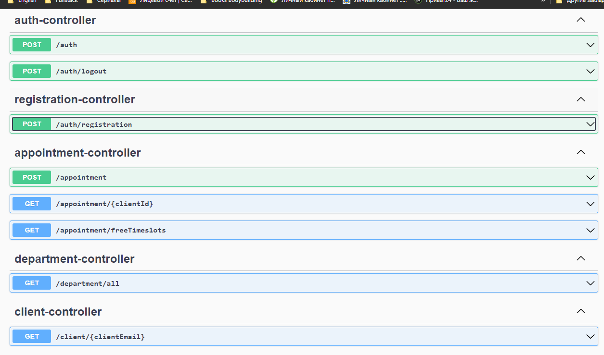

**Description of Requests and possible Responses**
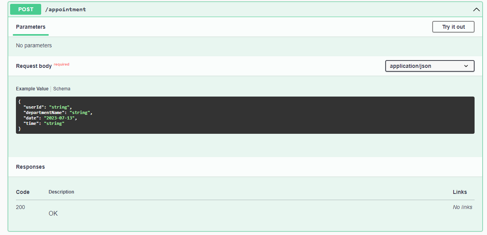
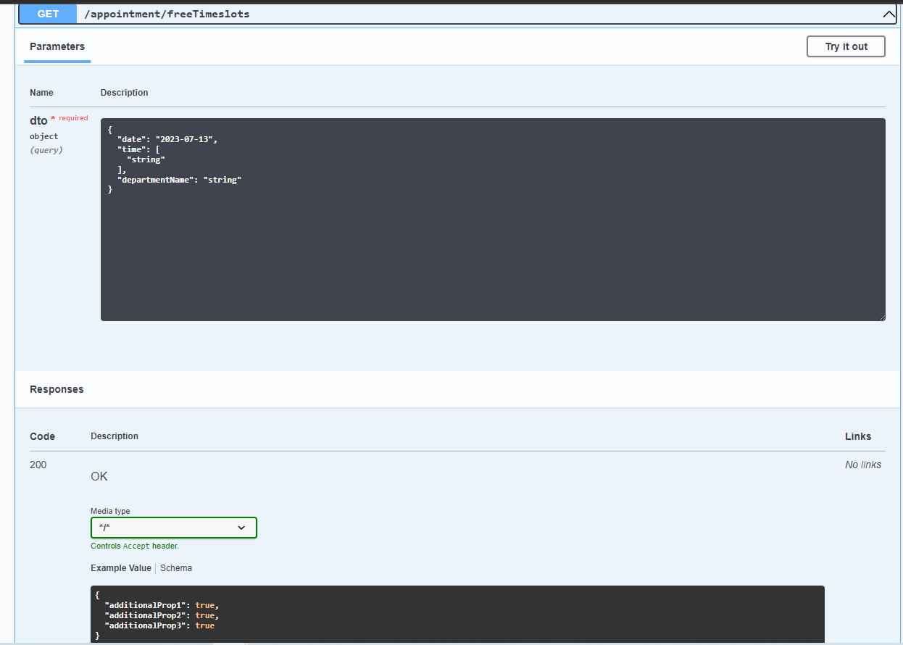
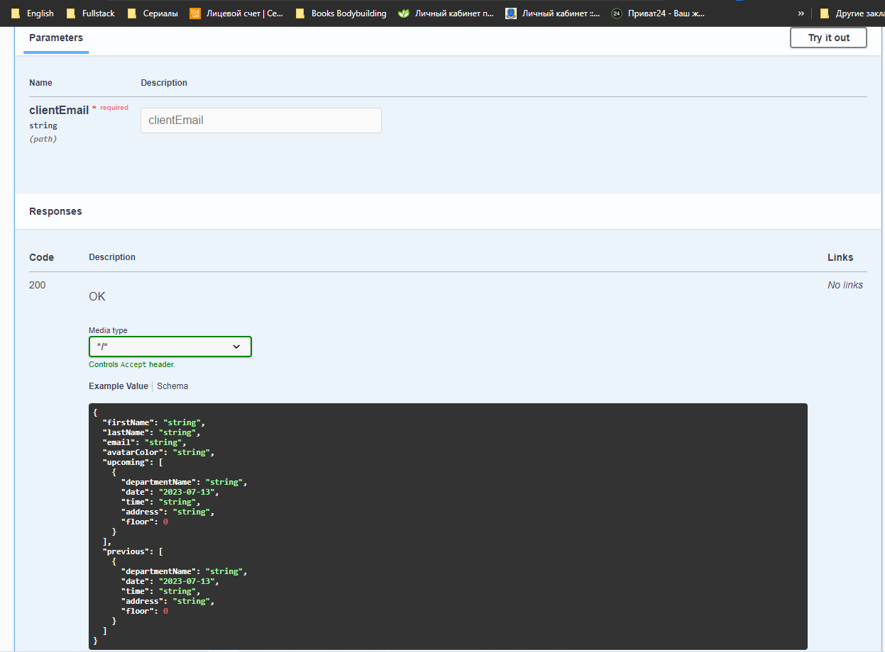

**Try to get an Error from the back-end side while POSTing data**
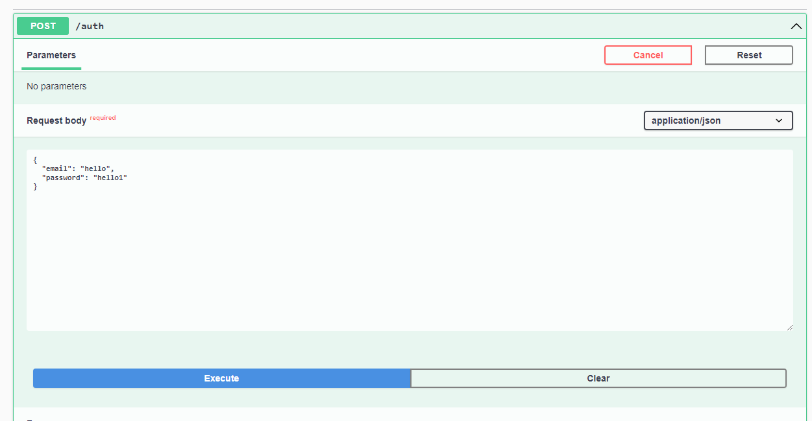
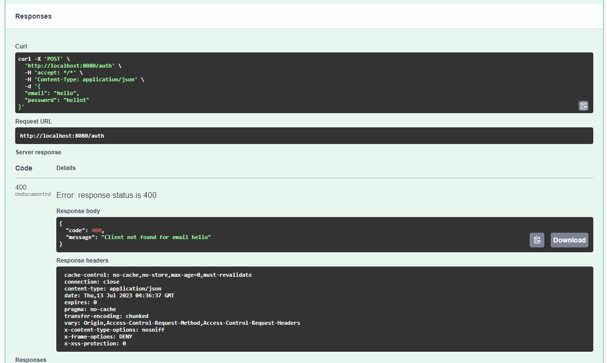

**Try to get a successful Response from the back-end side while POSTing data**
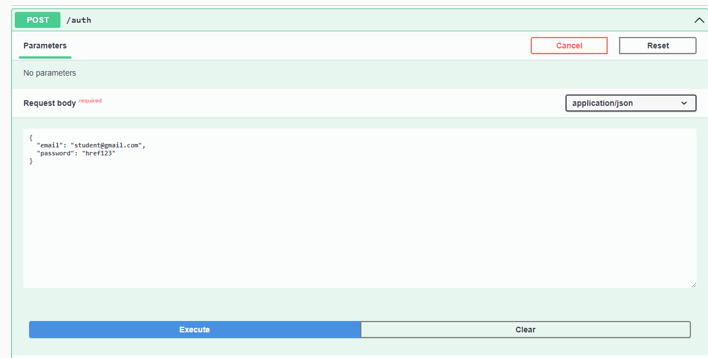
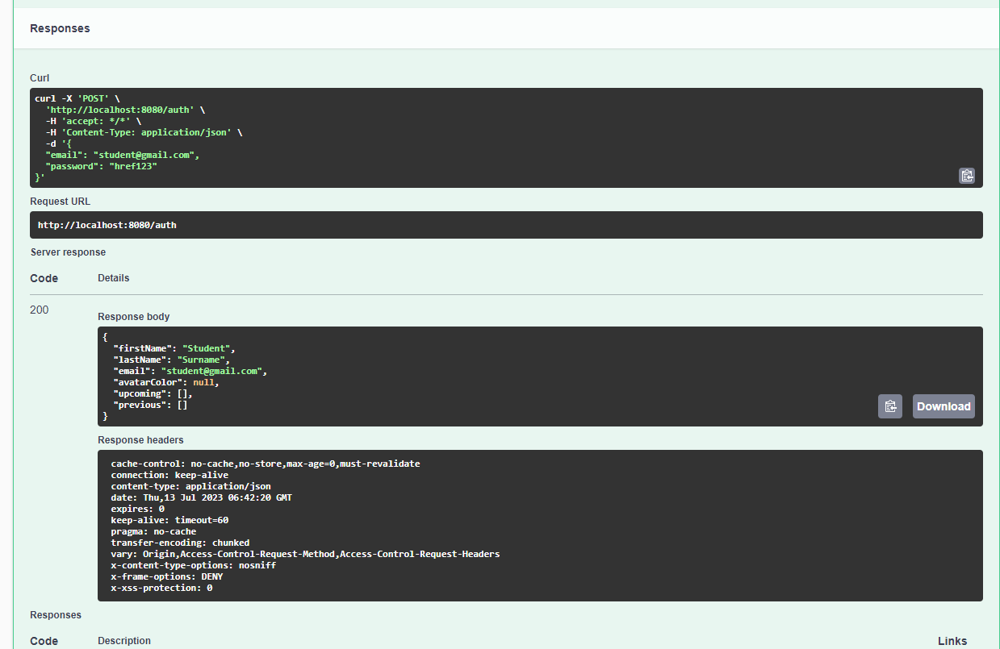

**The example of GET Request in Insomnia**
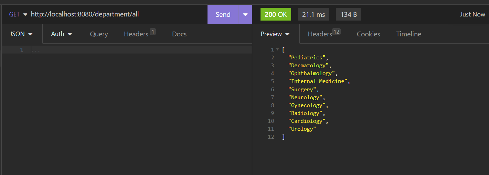

** Failed Request from Front-end side**
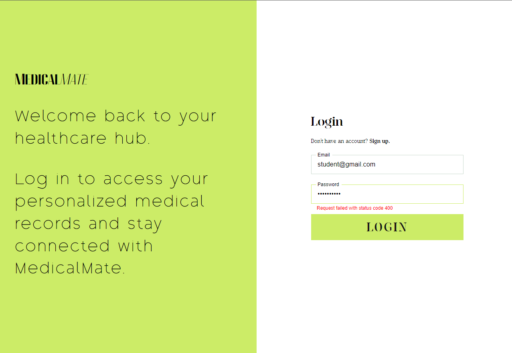

** Successful Request from Front-end side**
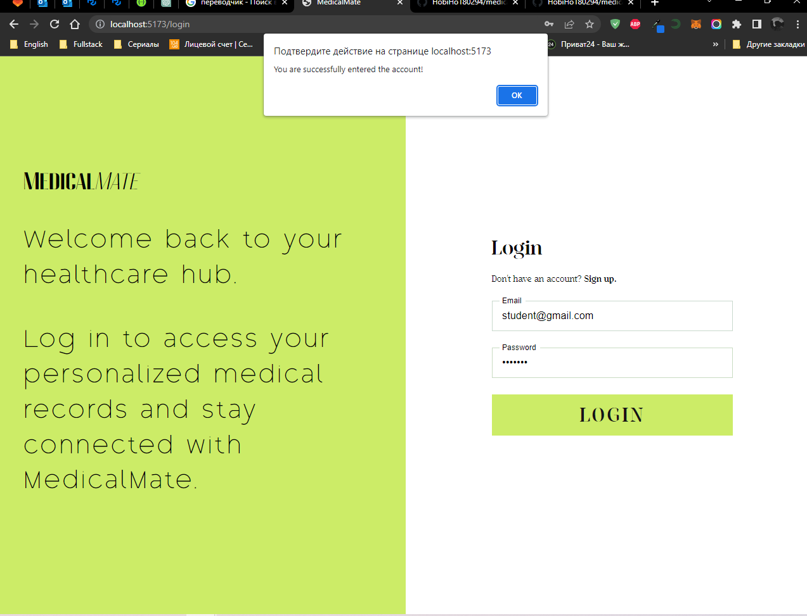

## Why HTTP protocol Interaction?
1. **Wide Compatibility**: HTTP (Hypertext Transfer Protocol) is a widely adopted protocol that is supported by almost all modern web browsers and servers. This compatibility ensures seamless communication between clients and servers, allowing for widespread interoperability across different platforms and devices.

2. **Stateless Nature**: HTTP is a stateless protocol, which means that each request from the client to the server is independent and does not maintain any memory of previous requests. This statelessness simplifies server-side implementation and scalability, as the server does not need to store client-specific information between requests. It also enables efficient load balancing and horizontal scaling of server resources.

3. **Versatility**: HTTP supports various request methods (GET, POST, PUT, DELETE, etc.) and allows for flexible data formats, including JSON, XML, and form data. This versatility enables developers to design and implement a wide range of web applications and services. Additionally, HTTP supports various status codes and headers, providing additional information and control over the client-server communication process.

## Code Examples

**User Registration**
```java
    public void register(RegistrationUserDto registrationUserDto) {
        validSignUpRequest(registrationUserDto);

        Client client = createUser(registrationUserDto);
        clientRepository.save(client);

        log.info("User with email: {}, was success registered", client.getEmail());
    }
```

**User Creation**
```java
    private Client createUser(RegistrationUserDto dto) {
        Client user = new Client();

        user.setEmail(dto.getEmail().toLowerCase());
        user.setPassword(passwordEncoder.encode(dto.getPassword()));
        user.setFirstName(dto.getFirstName());
        user.setLastName(dto.getLastName());
        user.setPhone(dto.getPhone());

        return user;
    }
```

**DepartmentNotFound Exception**
```java
public class DepartmentNotFoundException extends RuntimeException{

    public DepartmentNotFoundException() {
        super();
    }

    public DepartmentNotFoundException(String message) {
        super(message);
    }
}
```

**Email Already In Use Exception**
```java
public class EmailAlreadyInUseException extends RuntimeException{

    public EmailAlreadyInUseException() {
        super();
    }

    public EmailAlreadyInUseException(String message) {
        super(message);
    }
}
```

## Conclusion
In conclusion, the back-end side of MedicalMAte leverages Java and Spring Boot, along with Docker for optimized deployment. Java and Spring Boot provide a robust and mature framework, offering strong community support, enhanced security, seamless integration capabilities, and scalability. By utilizing Docker, all necessary dependencies are stored in containers, ensuring consistent and reproducible environments, streamlining setup processes, and enhancing performance. With these technologies, MedicalMAte's back-end is equipped to deliver reliable, secure, and efficient services to users, facilitating a seamless online clinic experience.

## Useful Links
1. https://docs.oracle.com/en/java/
2. https://docs.spring.io/spring-boot/docs/current/reference/htmlsingle/
3. https://docs.docker.com/
4. https://www.docker.com/products/docker-desktop/
5. https://hub.docker.com/
6. https://swagger.io/docs/
7. https://www.postgresql.org/docs/

## Project Links
1. [Figma](https://www.figma.com/file/ghvPEzKNHsSlatU90rv79s/MedicalMate?type=design&node-id=141%3A43&mode=dev)
2. [Front-end Repository](https://github.com/HobiHo180294/medical-mate)
3. [Back-end Repository](https://github.com/HobiHo180294/medical-mate-back-end)

**© 2023 All Rights Reserved**
